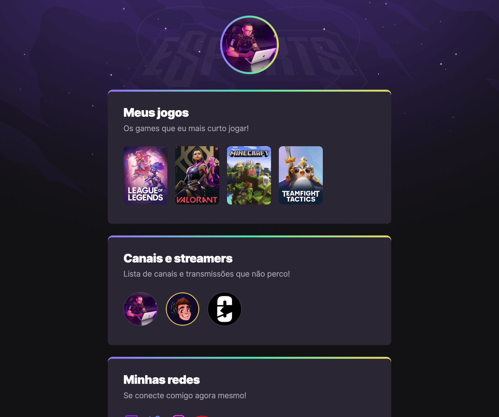

<h1 align="center">NLW eSports - Front-end Project</h1>

<p align="center">
  Project developed as a practical exercise based on the <strong>Next Level Week #9</strong> event, promoted by Rocketseat in September 2022.
</p>

<p align="center">
  <a href="#-about-the-project">About</a>&nbsp;&nbsp;&nbsp;|&nbsp;&nbsp;&nbsp;
  <a href="#-technologies">Technologies</a>&nbsp;&nbsp;&nbsp;|&nbsp;&nbsp;&nbsp;
  <a href="#-layout">Layout</a>&nbsp;&nbsp;&nbsp;|&nbsp;&nbsp;&nbsp;
  <a href="#-how-to-use">How to Use</a>&nbsp;&nbsp;&nbsp;|&nbsp;&nbsp;&nbsp;
  <a href="#memo-license">License</a>
</p>

<br>

<p align="center">
  
</p>

## 🚀 About the Project

This project was built during **NLW #9 – eSports**, an online and free event held by Rocketseat between **September 11 and 18, 2022**. Although it was launched some time ago, I used it as a hands-on challenge to **practice foundational HTML and CSS concepts** as part of my current Full Stack training.

The challenge was to create an **interface inspired by the gaming universe**, working as a link aggregator:

- Profile image at the top
- List of favorite games
- Links to favorite streamers
- Footer with social media icons

This page serves as a kind of **personalized gamer portfolio** or digital card for content creators.

> ✨ *"Embark on a mission to reach your next level in programming. Build a brand-new project in the gaming universe, learn new skills and technologies, and boost your career as a dev."*

---

## 🧠 About this Repository

This repository represents my learning journey using content from **NLW #9** as a reference to strengthen HTML and CSS skills.  
I rebuilt the interface based on the original layout, focusing on structure, semantics, and clean styling.

---

## 🛠 Technologies

This project was developed using:

- HTML
- CSS
- Figma (for layout reference)

---

## 🎨 Layout

You can view the original layout on Figma:  
🔗 [View on Figma](https://www.figma.com/design/5MGE9ua70goTT3bMHHLW4S/NLW-eSports--Community---Copy-?node-id=6-23&p=f&t=S6Yl7mCeouvWghSi-0)

---

## 🔗 Live Project

Check out the live version of the project:

➡️ [View it on GitHub Pages](https://andreskull2.github.io/eSports/)

---

## ▶️ How to Use

To run it locally:

```bash
# Clone the repository
git clone https://github.com/andreskull2/eSports.git

# Enter the project folder
cd eSports

# Open the index.html file in your browser
```
---
## :memo: License
This project is licensed under the MIT License.
Feel free to use it as a reference or learning material — just remember to give credit where it’s due.

Made with ♥ by Rocketseat — Rebuilt with care by @andreskull2 🚀
:wave: [Join our community!](https://discord.gg/rocketseat)